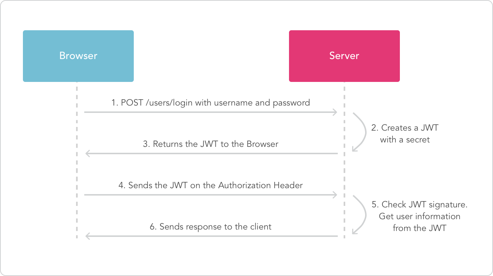

# typescript-node-workshop

A Node.js workshop with TypeScript for the Dublin TypeScript Meetup

## Pre-requisites

To complete this workshop tou are going to need to install a few things:

- [Node.js](https://nodejs.org/en/download)
- [Docker](https://store.docker.com/search?type=edition&offering=community) (Only if your OS supports it)
- [Postgres](https://www.enterprisedb.com/downloads/postgres-postgresql-downloads) (If your OS is not compatible with Docker)
- [Git Bash](https://git-scm.com/downloads) (It is the recommended CLI on Windows)
- [VsCode](https://code.visualstudio.com) (It is the recommended editor)
- [SQLECTRON](https://sqlectron.github.io/)

## Working with the Node.js package manager (npm)

At this point, we should have the `node` and `npm` commands correctly installed in our development environment. We can use the `npm` command to install third-party Node.js packages. The `npm` command allows us to install a few different kinds of dependencies:

- **Global dependencies** This kind of dependencies are shared across projects. They are installed in our development environment, outside of a project. An example of this kind of dependencies is a CLI tool such as the `tsc` command because we will invoke it from our CLI, not from a project.

- **Local Dependencies** This kind of dependencies are installed locally, inside of a project. They are not shared across projects, and they are needed during the execution of the application, or in other words, after the application has been deployed and the development phase has been completed. An example of this kind of dependency is a framework or library that we use to build our application such as Express.js.

- **Development dependencies** This kind of dependencies are installed locally, inside of a project. They are not shared across the project, and they are needed only during the development phase. An example of this kind of dependency is a development tool that we use only during the development phase such as a testing library.

We can install npm dependencies using the following commands:

| Command                                         | Description                                             |
| ----------------------------------------------- | ------------------------------------------------------- |
| `npm install`                                   | Install all the dependencies in the `package.json` file |
| `npm install -g NAME_OF_THE_DEPENDENCY`         | Install a global dependency                             |
| `npm install --save NAME_OF_THE_DEPENDENCY`     | Install a local dependency                              |
| `npm install --save-dev NAME_OF_THE_DEPENDENCY` | Install a local development dependency                  |

The `npm` command uses a configuration file named `package.json`. We should create a new `package.json` file in each new project. We can create a new `package.json` file using the following command:

```bash
npm init
```

You can answer the questions with `y` (yes) and `n` (no) in most cases. The command will ask you a few questions such as what is the license of your project. You can pass the `--y` flag if answering these questions is bothering you:

```bash
npm init --y
```

After creating the `package.json` file, you will notice that every time we install a local or development dependency, its name and version are recorded in the `package.json` file. 

The local and development dependencies are downloaded and saved in a directory named `node_modules` inside a project. The `node_modules` directory is located in the same directory that contains the `package.json` file.

The `node_modules` directory can sometimes be a problem because it contains a huge number of files. If we want to share our project online, it will take a lot of storage, and it will be slow to download and upload. For these reasons, we should try to avoid sharing the `node_modules` directory. We can delete it because it can be restored. The `package.json` file contains a list of all the dependencies and their respective versions. We can install all the dependencies in the `package.json` file using the following command:

```bash
npm install
```

> The preceding command will only work if a `package.json` file is located in the current directory.

It is also essential that sometimes you might want to install a particular version of a module as opposed to the latest version. The `npm` command will install the latest version by default, but we can install a particular version by appending `@` and the version number to the name of a module. For example:

```bash
npm install typescript@3.1.6
```

Now that we know the basics about the `npm` command, we are going to use it to install some global dependencies.

You can learn more about npm by reading the official documentation at https://docs.npmjs.com.

## Working with type definitions

The Node.js package manager (npm) was initially created to work with JavaScript, not TypeScript. As a result, some npm modules can be or not be compatible with TypeScript. For a module to be compatible with TypeScript, it must contain a special kind of file with the extension `.d.ts` known as type definitions.

The type definition files declare the types of the public interface of a module. When an npm module includes type definitions, the module is automatically compatible with TypeScript, but when the module is not compatible with TypeScript, it is possible to try to install and additional npm module that contains the type definitions. 

For example, the `express` module is not compatible with TypeScript by default, but we can solve the problem by installing the `@types/express` module:

```bash
npm install --save express
npm install --save-dev @types/express
```

Other modules such as the `typeorm` module are compatible with TypeScript because it includes type definitions. In this case, installing the `typeorm` module is enough:

```bash
npm install typeorm
```

## Installing TypeScript and ts-node

We are going to install the `typescript` and `ts-node` modules as global dependencies. This means that we need to use the following command:

```bash
npm install -g typescript
npm install -g ts-node
```

Because we have installed both modules as global dependencies, these will be shared across all projects in our development environment. This means that we only need to run these commands once and we don't need to install them every time we create a new project.

The `typescript` module will install a command named `tsc`. The `tsc` command is the TypeScript compiler, and it can be used to transform TypeScript files into JavaScript files. The `ts-node` command is used to compile and execute TypeScript files using Node.js.

## Validating the installation of TypeScript & ts-node

After installing TypeScript, the command `tsc` should become available. If you try to run the following command in Bash, you should be able to see the TypeScript version displayed in the as output:

```bash
tsc -v
```

We can additionally check that the `ts-node` command has also been installed successfully by using the following command:

```bash
ts-node -v
```

Just like before if everything went right, we should see the version of `ts-node` displayed in the bash. The `ts-node` command will also display the version of other required commands such as the `tsc` command.

## Bash basics

Before you can continue, you must know the basics about navigating through directories using the CLI. The following table showcases some of the commands and symbols that you are going to need at some point or another in the upcoming chapters:

| Symbols                      | Description                                                |
| ---------------------------- | ---------------------------------------------------------- |
| `.`                          | The current directory                                      |
| `..`                         | The parent directory of the current directory              |
| `~`                          | The "home" directory of the current user                   |
| `*`                          | Wildcard that matches any directory                        |

*Figure 5: Directory references in Bash*

| Command                      | Description                                                          |
| ---------------------------- | -------------------------------------------------------------------- |
| `ls`                         | Display the files and directories in the current directory           |
| `cd ./CODE/my_project`       | Move into child directory                                            |
| `cd ..`                      | Return to the previous directory                                     |
| `cd ~`                       | Move to the Home directory                                           |
| `mkdir demo1`                | Creates a new directory named demo1                                  |
| `cat file.txt`               | Displays the contents of a file                                      |
| `rm -r -f  ./node_modules`   | Remove all directories and child directories without confirmation    |

## Creating a new TypeScript project

Each new TypeScript project requires a new empty directory. It is recommended to create a new directory under a directory that you can find with ease such as your home directory. 

For example, you can create a directory named `CODE` under your home directory, To achieve this we first need to open a bash terminal and navigate to the home directory:

```bash
cd ~
```

We can then create a new directory named `CODE`:

```bash
mkdir ./CODE
```

> Some cloud services such as Microsoft One Drive and Dropbox can create a copy of your user's folders (e.g., Desktop, Documents) and syncs them with a cloud storage service. As a result, when we create a file in our Desktop using the Windows GUI, the file is not created under the `~/Desktop` directory, and it is created under the `~/One\ Drive/Desktop` directory instead. For this reason, it is recommended to store the examples always under the `~/CODE` directory and avoid potential problems.

You can then create a new directory for each project inside the `CODE` directory. The `~/CODE` directory should only be created once. Then for each new project, we are going to create a new directory under the `~/CODE` directory:

```bash
mkdir ./CODE/demo
```

> Please try to avoid using white spaces in the name of your files and directories. Use underscore “_” instead. Using whitespaces makes navigating using the CLI slightly more difficult.

We can then navigate into the directory:

```bash
cd ~/CODE/demo
```

We are now going to focus on the steps required to create a TypeScript project independently of the kind of application that we will build.

All our TypeScript projects are going to need the following:

- A new empty directory
- A TypeScript compiler configuration file (`tsconfig.json`)
- An npm configuration file (`package.json`)

At this point, we have created a directory named `demo` under the `~/CODE` directory, and we have navigated into it. We now need to create the TypeScript configuration file (`tsconfig.json`). We can do it using the following command:

```bash
tsc --init
```

We also need to create the npm configuration file (`package.json`) using the following command:

```bash
npm init --y
```

We can use the `ls` command to see the contents of the current directory. So far there should only be two files in the directory: The `tsconfig.json` file and the `package.json` file. Our directory should look as follows:

```txt
.
|-- package.json
`-- tsconfig.json
```

## Compiling and running a TypeScript project

Now that we have created the basic structure of a TypeScript project we are going to compile it and execute it. To compile the TypeScript project we need to use the `tsc` command and the project flag `-p` to specify the TypeScript compiler configuration file `tsconfig.json`:

```bash
tsc -p tsconfig.json
```

If everything goes well, this will generate a new file named `demo.js` right next to the existing `demo.ts` file. We can then execute the new JavaScript file `demo.js` using the `node` command:

```bash
node ./src/demo.js
```

The `node` command can only be used to execute JavaScript files `.js` not TypeScript files `.ts` this means that we must compile our application before we can run it. This requires two steps, and it is a bit tedious. However, we can use the `ts-node` command to do the two steps with one single command:

```bash
ts-node ./src/demo.ts
```

The `ts-node` command is useful because it can be used to compile our TypeScript code into JavaScript code and then execute it using the Node.js runtime in just one step. If we don't use the `ts-node` command, we will be forced first to use the `tsc` command to compile our code and then use the `node` command to execute it.

## Creating a new TypeScript Node.js project

We have learned how to create a basic TypeScript project. However, if we are going to work on a Node.js application, we must perform a few additional steps.

First, we are going to install the Node.js type definitions. We can do this using npm:

```bash
npm install --save-dev @types/node
```

The Node.js type definitions should allow us to import the Node.js core modules. For example, we can import the file system module as follows:

```javascript
import * as fs from "fs";
```

We are also going to open the `tsconfig.json` and uncomment the `lib` setting and add the following value:

```javascript
"lib": [ "es6", "dom" ]
```

The preceding should allow us to work with some of the JavaScript APIS of the ES6 specification such as the Promise API.

We now know how to create a generic TypeScript Node.js project, but we need to be a little more specific. We are going to focus on building Node.js using a framework known as Express.js. We will learn more about Express.js in the upcoming chapters, but we will learn how to install it now.

To be able to use Express.js, we need to install the `express` module and its type definitions `@types/express`.

```bash
npm install --save express
npm install --save-dev @types/express
```

We can then import express as follows from our application:

```javascript
import express from "express";
```

Remember that this will fail if you forget to install both modules.

## Running an Express application

At this point, we should be able to create a simple Express application and execute it to see if everything has gone right so far. We are going to change the content of the `demo.ts` file from:

```javascript
console.log("Hello world!");
```

To the following:

```javascript
import express from "express";

const app = express()
const port = 3000

app.get('/', (req, res) => res.send('Hello World!'));

app.listen(
  port,
  () => console.log(`Example app listening on port ${port}!`)
);
```

We can then the run the Express application using:

```bash
ts-node ./src/demo.ts
```

If everything goes well the following should be displayed as output:

```bash
Example app listening on port 3000!
```

You can then open Google Chrome and visit http://localhost:3000, and if everything went well you should see the following on the screen:

```
Hello World!
```

The preceding code snippet creates an HTTP server and starts running it. Once the server is running, you cannot use the CLI anymore unless you kill the process. You can kill the process by pressing `Ctrl` + `c` while you set the focus on the CLI window.

If you change your code, you will need to:

1. Save the changes
2. Kill the process using `Ctrl` + `c`
3. Rerun it with `ts-node`

You probably think that this process is too slow. We will now learn a way to automatically re-load the server when the code changes but it is essential to understand how it works under the hood.

## Automatically restart the server when the code changes

We can automatically re-load our Express.js application when the source code changes using the `nodemon` command. To use it we need to install the `nodemon` module as a global dependency:

```bash
npm install -g nodemon
```

We then need to create a nodemon.json file with the following content.

```javascript
{
  "watch": ["src"],
  "ext": "ts",
  "ignore": ["src/**/*.spec.ts"],
  "exec": "ts-node ./src/demo.ts"
}
```

This configuration file configures how `nodemon` should behave:

| Field           | Description                                              |
| --------------- | -------------------------------------------------------- |
| `watch`         | The directories or files to be monitored                 |
| `ext`           | The file extension of the files to be monitored          |
| `ignore`        | The files that we wish to exclude                        |
| `exec`          | The command to be executed if the monitored files change |

We can run the application using `nodemon`:

```bash
nodemon
```

The `nodemon` process uses the `nodemon.json` file. This configuration monitors changes in the `src` folder and executes the `ts-node ./src/demo.ts` command every time there is a change. By doing this, you will not need to worry about manually killing the server and starting it again everytime you change a file.

## Installing Postgres with Docker

We are going to install the Docker community edition (AKA Docker CE).

> **Warning** Please note that it is not possible to install Docker in all the versions of Windows. If Docker is not compatible with your version of Windows, you have a few options. You can install Linux in a partition of your HDD, or you can install Postgres directly without Docker. You can download the Postgres binary for Windows at https://www.enterprisedb.com/downloads/postgres-postgresql-downloads

> **Info** You can download Docker CE at https://store.docker.com/search?type=edition&offering=community. Please note that you will be required to create an account.

After installing Docker, you might have to restart your computer, and it might take a few minutes before the Docker service is ready. After installing Docker, you are going to need to download the Docker image for Postgres 9.5. You can do this using the following command:

```bash
docker pull postgres:9.5
```

You can then use the following command to see the list of all the Docker images installed on your computer:

```bash
docker images
```

The Postgres 9.5 image should be displayed in the list. At this point, we need to run a Docker container. Each container is a running instance of an image. We can have multiple containers running of a given image, but this time we will only run one container because we don’t need two instances of Postgres. We can create a Docker container with the Postgres image using the following command:

```bash
docker run --name POSTGRES_USER -p "$DATABASE_PORT":"$DATABASE_PORT" -e POSTGRES_PASSWORD="$DATABASE_PASSWORD" -e POSTGRES_USER="$DATABASE_USER" -e POSTGRES_DB="$DATABASE_DB" -d postgres:9.5
```

### Docker basics

We have already learned how to download Docker images using the `docker pull` command and how to create a container using the `docker run` command. We will now learn about other basic Docker commands.

We can use the `docker ps` command to see all the containers in our machine:

```bash
docker ps -a
```

We should be able to see the Postgres container running. Each container and image has an associated ID that looks like the following.

```bash
a839792d7f89
```

We can use the following command to stop a running Docker container:

```bash
docker stop INSERT_CONTAINER_ID_HERE
```

Similarly, we can run a Docker container using the start command:

```bash
docker start INSERT_CONTAINER_ID_HERE
```

Please note that the run command is used to create a new Docker container while the start command is used to run an existing Docker container given its ID.

We can use the following command to remove a Docker container:

```bash
docker rm INSERT_CONTAINER_ID_HERE
```

Please note that before you can remove a Docker container, you must stop it. The following command can be used to remove a Docker image:

```bash
docker rmi INSERT_IMAGE_ID_HERE
```

Please note that before you can remove a Docker image, you must stop and remove all its associated containers.

## 

## The project directory architecture

We are going to create the following project directory architecture:

```txt
.
├── nodemon.json
├── package.json
├── package-lock.json
├── src
│   ├── backend
│   │   ├── config
│   │   │   ├── app.ts
│   │   │   ├── auth.ts
│   │   │   └── db.ts
│   │   ├── controllers
│   │   │   ├── auth_controller.ts
│   │   │   ├── comments_controller.ts
│   │   │   ├── links_controller.ts
│   │   │   └── user_controllet.ts
│   │   ├── entities
│   │   │   ├── comment.ts
│   │   │   ├── link.ts
│   │   │   ├── user.ts
│   │   │   └── vote.ts
│   │   ├── index.ts
│   │   └── repositories
│   │       ├── comment_repository.ts
│   │       ├── link_repository.ts
│   │       ├── user_repository.ts
│   │       └── vote_repository.ts
│   └── frontend
│       └── client.ts
├── tests
│   └── app.test.ts
└── tsconfig.json
```

## Setting environment variables

### In Linux and Mac

In Mac and Linux we can use the following commands in Bash to create environment variables:

```bash
export DATABASE_USER=postgres
export DATABASE_PASSWORD=secret
export DATABASE_HOST=localhost
export DATABASE_PORT=5432
export DATABASE_DB=demo
```

### In windows

In Windows, we need to open the Windows Command Prompt (AKA cmd.exe) as an administrator. We can do this by using the right click over the Windows Command Prompt icon and selecting “Open as administrator”.

We can then execute the following commands:

```bash
setx DATABASE_USER "postgres"
setx DATABASE_PASSWORD "secret"
setx DATABASE_HOST "localhost"
setx DATABASE_PORT "5432"
setx DATABASE_DB "demo"
```

## Checking the environment variables

We can then test that everything went right by opening a new Bash. If you have already a Bash open. Please make sure that you close it and open it again because it needs to be restarted before it becomes aware of the new environment variables. Once you have the new Bash open, you can use the echo command to display the value of these environment variables:

```bash
echo $DATABASE_USER
echo $DATABASE_PASSWORD
echo $DATABASE_HOST
echo $DATABASE_PORT
echo $DATABASE_DB
```

Each of the preceding commands should display the value corresponding to each of the environment variables.

## Creating a database connection

The file `./src/backend/config.db.ts` creates a database connection using TypeORM. We can create a database connection using the following code snippet:

```ts
import { createConnection } from "typeorm";
// We will add some entities later!
// import { Link } from "../entities/link";
// import { User } from "../entities/user";
// import { Vote } from "../entities/vote";
// import { Comment } from "../entities/comment";

export async function createDbConnection() {

    // Read environment variables
    const DATABASE_HOST = process.env.DATABASE_HOST;
    const DATABASE_PASSWORD = process.env.DATABASE_PASSWORD;
    const DATABASE_USER = process.env.DATABASE_USER;
    const DATABASE_DB = process.env.DATABASE_DB;

    if (DATABASE_HOST === undefined) {
        throw new Error("Missing environment variable DATABASE_HOST");
    }

    if (DATABASE_PASSWORD === undefined) {
        throw new Error("Missing environment variable DATABASE_PASSWORD");
    }

    if (DATABASE_USER === undefined) {
        throw new Error("Missing environment variable DATABASE_USER");
    }

    if (DATABASE_DB === undefined) {
        throw new Error("Missing environment variable DATABASE_DB");
    }

    // Open a database connection
    await createConnection({
        type: "postgres",
        host: DATABASE_HOST,
        port: 5432,
        username: DATABASE_USER,
        password: DATABASE_PASSWORD,
        database: DATABASE_DB,
        entities: [
            // We will add some entities later
            // Link,
            // User,
            // Comment,
            // Vote
        ],
        synchronize: true
    });

}
```

Please visit the [official TypeORM documentations](https://typeorm.io/#/connection) if you need to learn more about the connection API.

### Creating an Express.js application

The following code snippet creates a new Express.js application instance:

```ts
import express from "express";
import bodyParser from "body-parser";
import { createDbConnection } from "./db";
// We will add some controller later
// import { getAuthController } from "../controllers/auth_controller";
// import { getUserController } from "../controllers/user_controllet";
// import { getLinksController } from "../controllers/links_controller";
// import { getCommentsController } from "../controllers/comments_controller";

export async function createApp() {

    // Create db connection
    await createDbConnection();

    // Creates app
    const app = express();

    // Server config to be able to send JSON
    app.use(bodyParser.json());
    app.use(bodyParser.urlencoded({ extended: true }));

    // Declare main path
    app.get("/", (req, res) => {
        res.send("This is the home page!");
    });

    // Declare controller instances
    // We will add some controller later
    // const authController = getAuthController();
    // const userController = getUserController();
    // const linksController = getLinksController();
    // const commentsController = getCommentsController();

    // Declare routes
    // We will add some routes later
    // app.use("/api/v1/auth", authController);
    // app.use("/api/v1/users", userController);
    // app.use("/api/v1/links", linksController);
    // app.use("/api/v1/comments", commentsController);

    return app;
}
```

### The application's entry point

The `./src/backend/index.ts` should containt the following code snippet:

```ts
import { createApp } from "./config/app";

(async () => {

    const app = await createApp();

    // Start the server
    app.listen(8080, () => {
        console.log(
            "The server is running in port 8080!"
        );
    });

})();
```

It creates an Express.js application instance and starts listening for incoming HTTP request in port `8080`. If you visit `http://localhost:8080`, you should be able to see `This is the home page!` displayed on screen.

## Declaring entitites

In TypeORM entities are declared as classes with some annotations.

We recommend reading the following docs:

- [Decorators in TypeScript](https://www.typescriptlang.org/docs/handbook/decorators.html)
- [Entities in TypeORM](https://typeorm.io/#/entities)
- [Relations in TypeORM](https://typeorm.io/#/relations)

### Link

```ts
import { Entity, Column, PrimaryGeneratedColumn, OneToMany, ManyToOne } from "typeorm";
import { Comment } from "./comment";
import { Vote } from "./vote";
import { User } from "./user";
import * as joi from "joi";

@Entity()
export class Link {

    @PrimaryGeneratedColumn()
    public id!: number;

    @Column()
    public userId!: number;

    @Column()
    public title!: string;

    @Column()
    public url!: string;

    // An user can have many links but a link only belongs to an user
    @ManyToOne(type => User, user => user.comments)
    public user!: User;

    // A link can have many comments but a comment only belongs to a link
    @OneToMany(type => Comment, comment => comment.link)
    public comments!: Comment[];

    // A link can have many votes but a vote only belongs to a link
    @OneToMany(type => Vote, vote => vote.link)
    public votes!: Vote[];

}
```

### User

```ts
import { Entity, Column, PrimaryGeneratedColumn, OneToMany } from "typeorm";
import * as joi from "joi";
import { Vote } from "./vote";
import { Link } from "./link";
import { Comment } from "./comment";

@Entity()
export class User {

    @PrimaryGeneratedColumn()
    public id!: number;

    @Column()
    public email!: string;

    @Column()
    public password!: string;

    // An user can have many votes but a link only belongs to an user
    @OneToMany(type => Link, link => link.user)
    public links!: Link[];

    // An user can have many votes but a vote only belongs to an user
    @OneToMany(type => Vote, vote => vote.user)
    public votes!: Vote[];

    // An user can have many votes but a vote only belongs to an user
    @OneToMany(type => Comment, comment => comment.user)
    public comments!: Comment[];

}
```

### Vote

```ts
import { Entity, Column, PrimaryGeneratedColumn, ManyToOne } from "typeorm";
import { Link } from "./link";
import { User } from "./user";

@Entity()
export class Vote {

    @PrimaryGeneratedColumn()
    public id!: number;

    @Column()
    public userId!: number;

    @Column()
    public linkId!: number;

    @Column()
    public isPositive!: boolean;

    // A link can have many votes but a vote only belongs to a link
    @ManyToOne(type => Link, link => link.votes)
    public link!: Link;

    // An user can have many votes but a vote only belongs to an user
    @ManyToOne(type => User, user => user.votes)
    public user!: User;

}
```

### Comment

```ts
import { Entity, Column, PrimaryGeneratedColumn, ManyToOne } from "typeorm";
import * as joi from "joi";
import { Link } from "./link";
import { User } from "./user";

@Entity()
export class Comment {

    @PrimaryGeneratedColumn()
    public id!: number;

    @Column()
    public userId!: number;

    @Column()
    public linkId!: number;

    @Column()
    public content!: string;

    // A link can have many comments but a comment only belongs to one link
    @ManyToOne(type => Link, link => link.comments)
    public link!: Link;

    // An user can have many comments but a comment only belongs to an user
    @ManyToOne(type => User, user => user.comments)
    public user!: User;

}

```

## Declaring repositories

```ts
import { getConnection, Repository } from "typeorm";
import { User } from "../entities/user";

export function getUserRepository(): Repository<User> {
    const connection = getConnection();
    return connection.getRepository(User);
}
```

## Declaring controllers

It is recommended to read the following documentation:

- [Routing in Express.js](https://expressjs.com/en/guide/routing.html)

```ts
import * as express from "express";
import * as joi from "joi";
import { Repository } from "typeorm";
import { User, userDetailsSchema, UserIdSchema } from "../entities/user";
import { getUserRepository } from "../repositories/user_repository";
import { authMiddleware } from "../config/auth";

// We pass the repository instance as an argument
// We use this pattern so we can unit test the handlers with ease
export function getHandlers(userRepository: Repository<User>) {

    // Creates a new user
    const createUser =  (req: express.Request, res: express.Response) => {
        (async () => {
            try {

                // Read and validate the user from the request body
                const newUser = req.body;
                const result = joi.validate(newUser, userDetailsSchema);
                if (result.error) {
                    res.json({ msg: `Invalid user details in body!`}).status(400).send();
                } else {
                    // Save the user into the database
                    await userRepository.save(newUser);
                    res.json({ ok: "ok" }).send();
                }

            } catch(err) {
                // Handle unexpected errors
                console.error(err);
                res.status(500)
                   .json({ error: "Internal server error"})
                   .send();
            }
        })();
    };

    // Get one user by its ID
    const getUserById =  (req: express.Request, res: express.Response) => {
        (async () => {
            try {

                // Get the user ID from the request URL and validate it
                const idStr = req.params.id;
                const userId = { id: parseInt(idStr) };
                const result = joi.validate(userId, UserIdSchema);
                if (result.error) {
                    res.status(400)
                    .json({ msg: `Invalid parameter id '${userId.id}' in URL` })
                    .send();
                } else {
                    // Try to find the user by the given ID
                    const user = await userRepository.findOne(userId);
                    // Return error HTTP 404 not found if not found
                    if (user === undefined) {
                        res.status(404)
                        .json({ msg: `User with id '${userId.id}' not found!` })
                        .send();
                    } else {
                        // Return the user
                        res.json(user).send();
                    }
                }

            } catch(err) {
                // Handle unexpected errors
                console.error(err);
                res.status(500)
                   .json({ error: "Internal server error"})
                   .send();
            }
        })();
    };

    return {
        createUser,
        getUserById
    };

}

export function getUserController() {

    const repository = getUserRepository();
    const handlers = getHandlers(repository);
    const router = express.Router();

    // Public
    router.post("/", handlers.createUser);

    // Private
    router.get("/:id", authMiddleware, handlers.getUserById);

    return router;
}
```

```ts
import express from "express";
import bodyParser from "body-parser";
import { createDbConnection } from "./db";
import { getUserController } from "../controllers/user_controllet"; // <--- HERE!

export async function createApp() {

    // Create db connection
    await createDbConnection();

    // Creates app
    const app = express();

    // Server config to be able to send JSON
    app.use(bodyParser.json());
    app.use(bodyParser.urlencoded({ extended: true }));

    // Declare main path
    app.get("/", (req, res) => {
        res.send("This is the home page!");
    });

    // Declare controller instances
    const userController = getUserController(); // <--- HERE!

    // Declare routes
    app.use("/api/v1/users", userController); // <--- HERE!

    return app;
}

```

```ts
// Create user
(async () => {
    const data = {
        email: "test@test.com",
        password: "mysecret"
    };
    const response = await fetch(
        "/api/v1/auth/login",
        {
            method: "POST",
            headers: {
                "Content-Type": "application/json"
            },
            body: JSON.stringify(data)
        }
    );
    const json = await response.json();
    console.log(json);
})();
```

### Implementing auth with JWT

The JSON web token (JWT) authentication workflow looks as follows:



It is recommened to read the following documents to understand the code snippets below:

- [Introduction to JSON Web Tokens](https://jwt.io/introduction/)
- [The node-jsonwebtoken docs](https://github.com/auth0/node-jsonwebtoken)
- [Writing middleware for use in Express apps](https://expressjs.com/en/guide/writing-middleware.html)
- [Using middleware](https://expressjs.com/en/guide/using-middleware.html)

We need to implement a controller to create a JWT when the user credentials are valid:

```ts
import * as express from "express";
import * as joi from "joi";
import jwt from "jsonwebtoken";
import { Repository } from "typeorm";
import { getUserRepository } from "../repositories/user_repository";
import { User, userDetailsSchema } from "../entities/user";
import { AuthTokenContent } from "../config/auth";

// We pass the repository instance as an argument
// We use this pattern so we can unit test the handlers with ease
export function getHandlers(AUTH_SECRET: string, userRepository: Repository<User>) {

    // Returns a JWT when the user credentials are valid
    const login =  (req: express.Request, res: express.Response) => {
        (async () => {
            try {
                // Read and validate the user details from the request body
                const userDetails = req.body;
                const result = joi.validate(userDetails, userDetailsSchema);
                if (result.error) {
                    res.status(400).send();
                } else {
                    // Try to find the user with the given credentials
                    const match = await userRepository.findOne(userDetails);
                    // Return error HTTP 404 not found if not found
                    if (match === undefined) {
                        res.status(401).send();
                    } else {
                        // Create JWT token
                        if (AUTH_SECRET === undefined) {
                            throw new Error("Missing environment variable DATABASE_HOST");
                        } else {
                            const tokenContent: AuthTokenContent = { id: match.id };
                            const token = jwt.sign(tokenContent, AUTH_SECRET);
                            res.json({ token: token }).send();
                        }
                    }
                }
            // Handle unexpected errors
            } catch(err) {
                console.error(err);
                res.status(500)
                   .json({ error: "Internal server error"})
                   .send();
            }
        })();
    }

    return {
        login
    };

}

export function getAuthController() {

    const AUTH_SECRET = process.env.AUTH_SECRET;

    if (AUTH_SECRET === undefined) {
        throw new Error("Missing environment variable AUTH_SECRET");
    }

    const repository = getUserRepository();
    const handlers = getHandlers(AUTH_SECRET, repository);
    const router = express.Router();

    // HTTP POST http://localhost:8080/auth/login/
    router.post("/login", handlers.login);

    return router;
}

```

We then need to create an Express.js middleware to validate the JWT before a private endpoint is executed:

```ts
import * as express from "express";
import jwt from "jsonwebtoken";

export interface AuthenticatedRequest extends express.Request {
    userId: number;
} 

export interface AuthTokenContent {
    id: number;
}

// Middleware function used for JWT token validation
export function authMiddleware(
    req: express.Request,
    res: express.Response,
    next: express.NextFunction
) {
    // Read token signature from environment variables
    const AUTH_SECRET = process.env.AUTH_SECRET;
    // Read token from request headers
    const token = req.headers["x-auth-token"];
    // Client error if no token found in request headers
    if (typeof token !== "string") {
        res.status(400).send();
    } else {
        // Server error is enironment variable is not set
        if (AUTH_SECRET === undefined) {
            res.status(500).send();
        } else {
            try {
                // Check that the token is valid
                const obj = jwt.verify(token, AUTH_SECRET) as AuthTokenContent;
                // Add the user ID to the HTTP request object
                // so we can access it from the NEXT request handler
                (req as AuthenticatedRequest).userId = obj.id;
                // Invoke NEXT request handler
                next();
            } catch(err) {
                // Unauthorized if the token cannot be verified
                res.status(401).send();
            }
        }
    }
}
```

Finally, we can protect an enpoint by applying the Express.js middleware:

```ts
export function getCommentsController() {

    const repository = getCommentRepository();
    const handlers = getHandlers(repository);
    const router = express.Router()

    // Private
    router.patch("/comments/:id", authMiddleware, handlers.updateComment);
    router.post("/comments", authMiddleware, handlers.createComment);
    router.delete("/comments/:id", authMiddleware, handlers.deleteCommentById);

    return router;
}
```

```ts
// Create link
(async () => {
    const data = {
        email: "test@test.com",
        password: "mysecret"
    };
    const response = await fetch(
        "/api/v1/links",
        {
            method: "POST",
            headers: {
                "Content-Type": "application/json",
                "x-auth-token": "INSERT_JSON_WEB_TOKEN_HERE"
            },
            body: JSON.stringify(data)
        }
    );
    const json = await response.json();
    console.log(json);
})();
```

